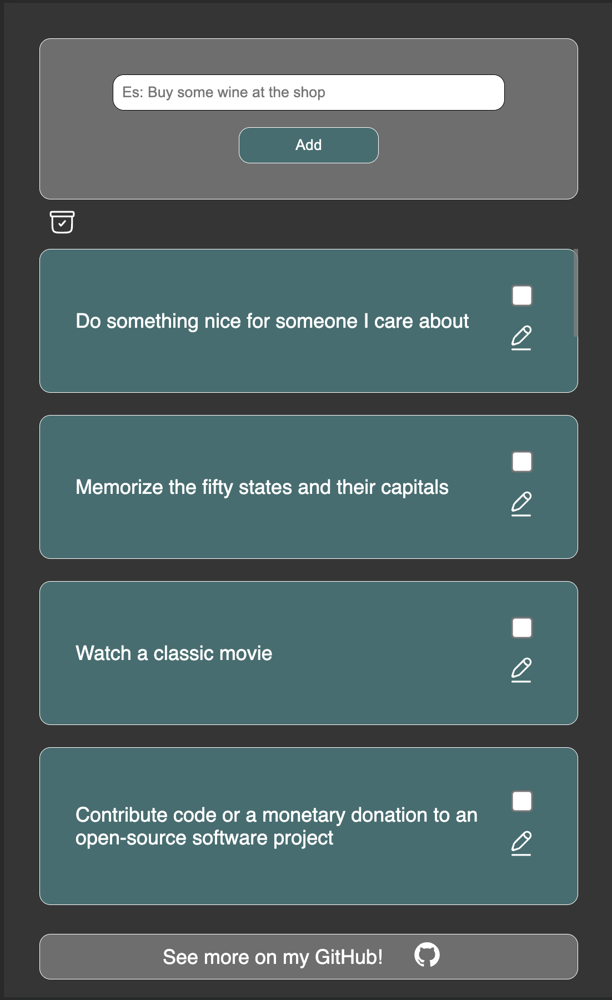
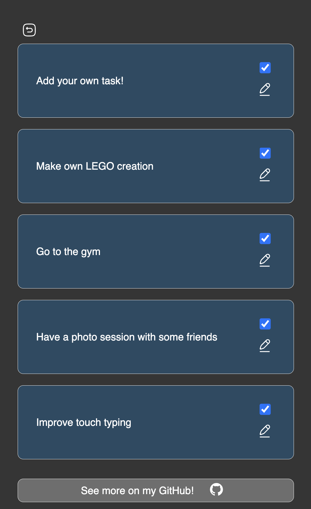

# Todo List App in React

## Description

This is a demonstrative Todo List application, designed to showcase basic functionalities of a task management tool. It's important to note that this app is purely demonstrative and is not intended for deployment in a production environment.

## Features

- **Drag and Drop**: Todo items can be rearranged using a drag-and-drop functionality, providing a flexible and intuitive user experience.
- **Add New Todo**: Users have the ability to add new todo items, allowing for dynamic list management.
- **Edit Todo**: After adding a todo, users can modify it as needed, ensuring the list always reflects current tasks.
- **Check Off Todos**: Todos can be marked as complete, and there's a dedicated section to view all checked items, aiding in tracking progress and task completion.

## Technologies Used

- **React**: For building the user interface in a modular and efficient way.
- **CSS Modules**: To locally scope CSS in a component-based architecture, avoiding style conflicts.
- **SASS**: As a CSS preprocessor to write more maintainable and extendable CSS.
- **react-beautiful-dnd**: A library utilized for implementing the drag-and-drop functionality with a beautiful, interactive UI.
